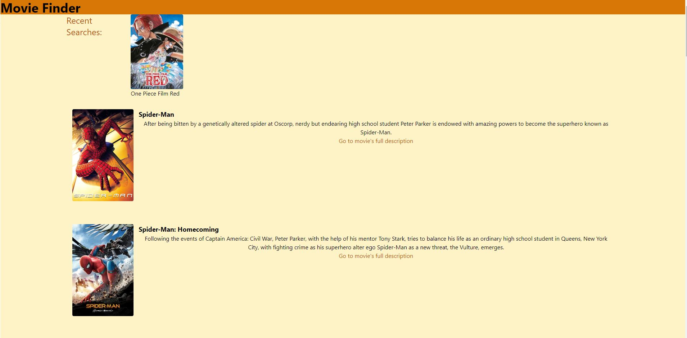
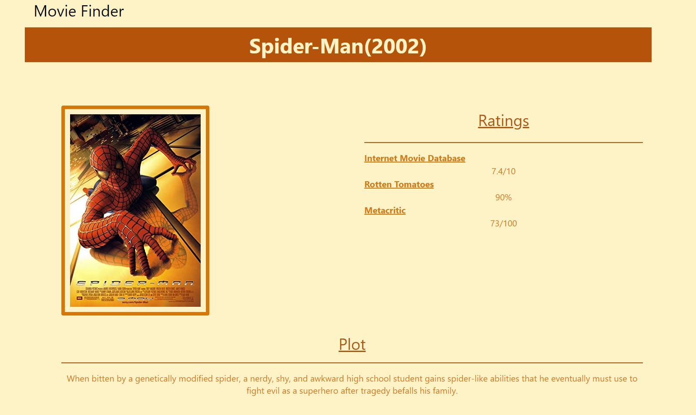

# Movie Finder

## Description

The following project is a movie search database that allows users to search for their favorite movies by inputting the title of said movie. It uses two different free APIs in order to get the data needed, and displays related results including the movie's title, year, ratings, poster, and a short synopsis. The more detailed information can be found when clicking the "see movie's full description" link.
Recent searches are also stored and displayed for easy access. Upcoming movies are also displayed at the top of the homepage.

The motivation for this project was to create an application that has the user's current movie themed interests organized in one place.

User Story:
AS a movie goer
I want to search for movies that fit my current interests
SO that I can find a movie I’m looking for and have the relevant information I want in one place.

## Usage

The application is simple to use. Simply enter your movie's title in the search bar, and press submit to get related movies!

## Credits

Collaborators include:

- https://github.com/TuinderJ
- https://github.com/P-AlejandroJimenez
- https://github.com/csara715
- https://github.com/cyounggreen
